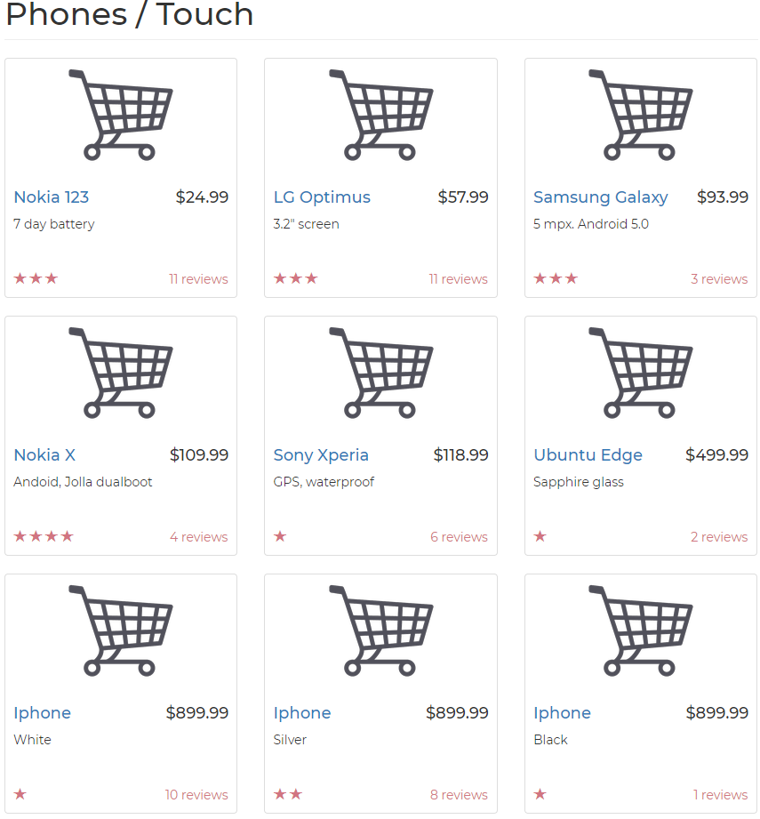
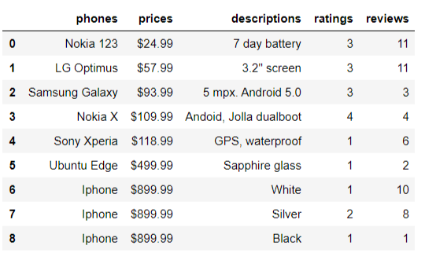

# Web Scraping

Learned basic webscraping by scraping [this site](https://webscraper.io/test-sites/e-commerce/allinone/phones/touch) using BeautifulSoup and creating a table containing names, prices, descriptions, reviews and ratings of the phones using pandas.

## Webpage

## Table created by scraping the webpage

