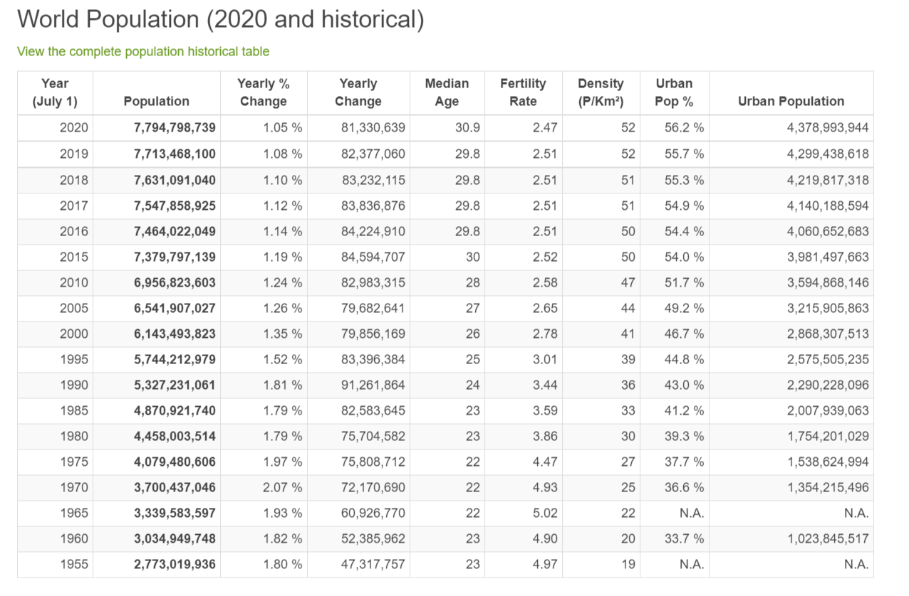
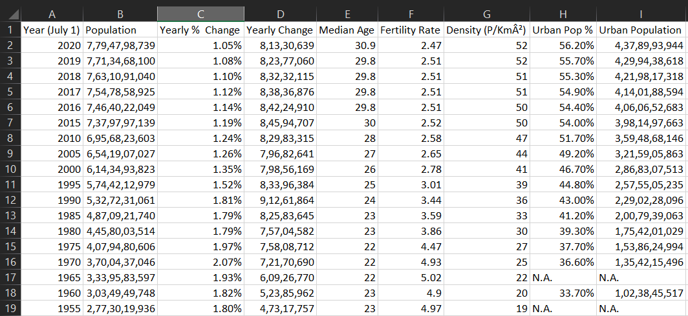

# Web Scraping from worldometers for population data

Scraping [this site](https://www.worldometers.info/world-population/) by extracting data from table using BeautifulSoup and storing it in csv format using pandas.

## Webpage

## Table data stored in csv format

