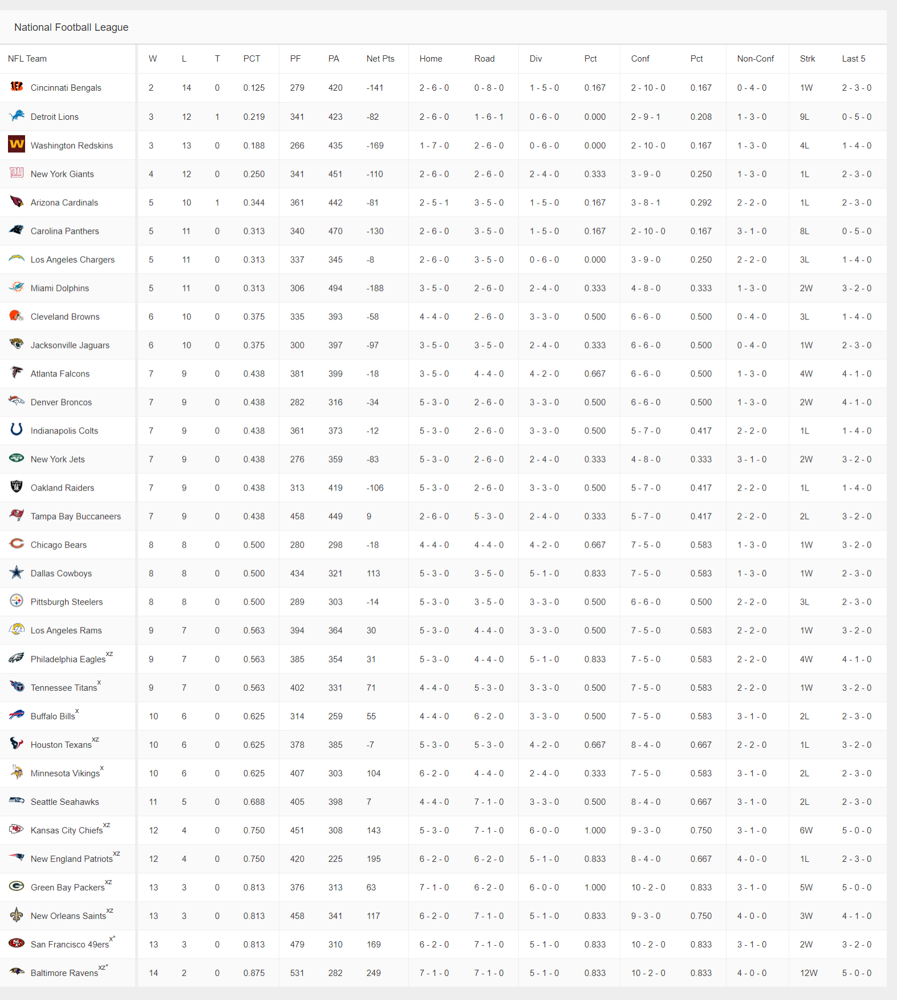
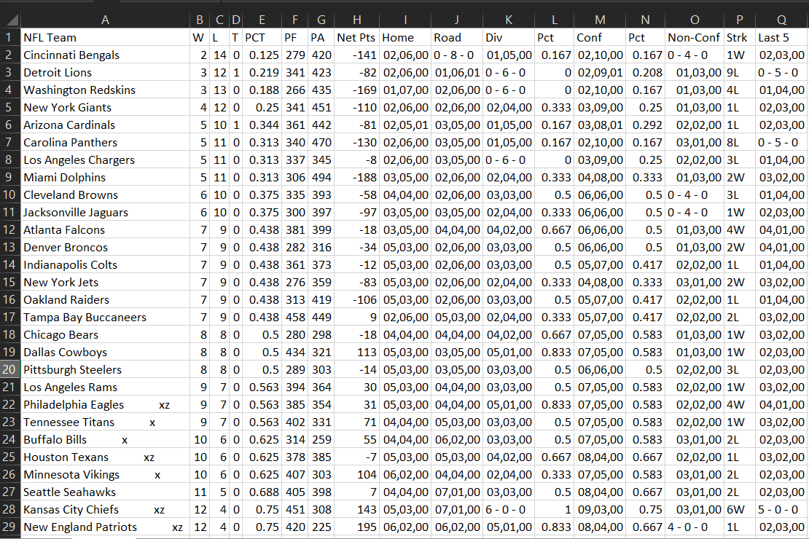

# Web Scraping from NFL standings data

Scraping [this site](https://www.nfl.com/standings/league/2019/reg/) by extracting data from table using BeautifulSoup and storing it in csv format using pandas.

## Webpage

## Table data stored in csv format

