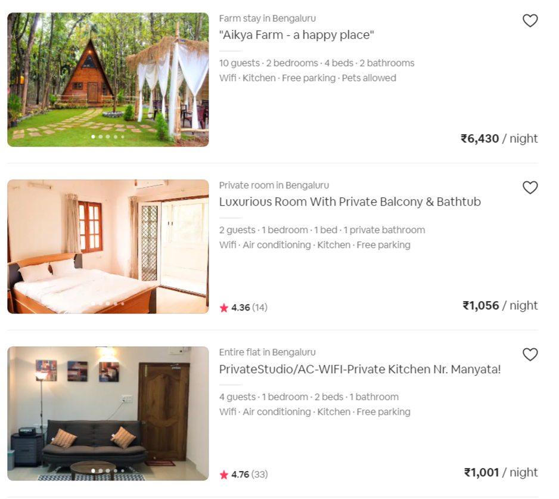
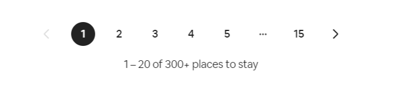
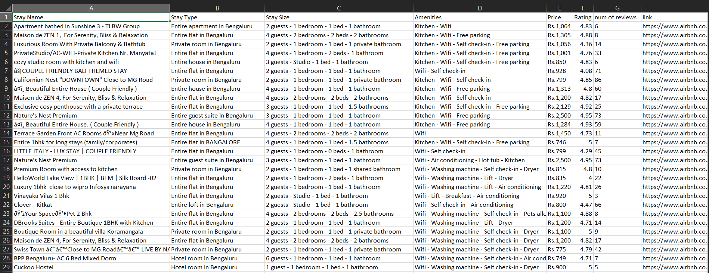

# Web Scraping from airbnb

Scraping [this site](https://www.airbnb.co.in/s/bangalore/homes) to:
- Search for a given location for homes in the airbnb site.
- Scraping the name, type, size, amenities, price, ratings, number of reviews and link of each stay from multiple pages using BeautifulSoup.
- Storing all the scraped data in a csv file for easy access using pandas.

## Webpage

### Note:
For some stays, some data will be unavailable.For example,in the first stay in the picture above,rating and reviews data is missing.
So in such cases,we ignore that particular stay and move on to scrape data from the next stay.

## As there are hundreds of stays available for each location,we have to scrape multiple pages to get data of all stays

## Data of stays in the airbnb site stored in csv format

