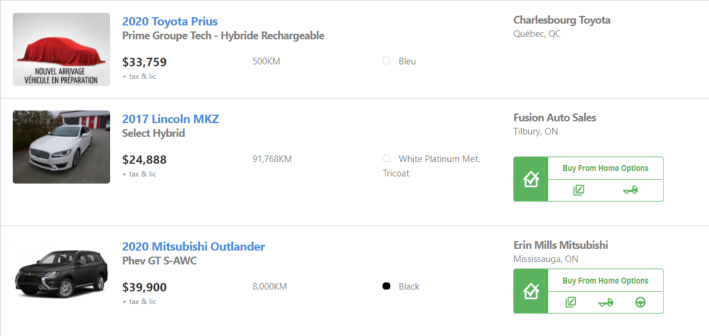
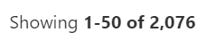
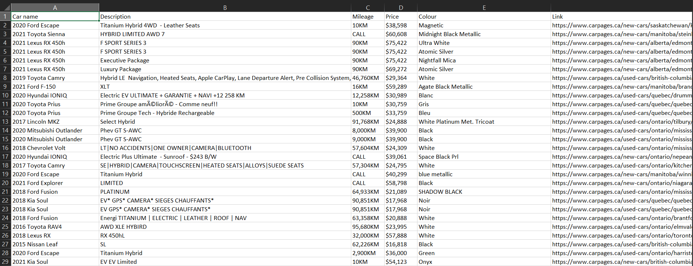

# Web Scraping from carpages.ca to find details of new and used cars

Scraping [this site](https://www.carpages.ca/used-cars/search/?fueltype_id%5B0%5D=3&fueltype_id%5B1%5D=7) to:
- Find the car name, description, mileage, price, colour and link from multiple pages using BeautifulSoup.
- Storing all the scraped data in a csv file for easy access using pandas.

## Webpage

### Note:
For some cars, some data will be unavailable. So in such cases, we ignore that particular car and move on to scrape data from the next car.

## As there are thousands of cars available in the website for each category, we have to scrape multiple pages to get data of all cars

## Data of cars is stored in csv format

### Scraped data of 2048 cars from 42 pages and it took less than 1 minute!

